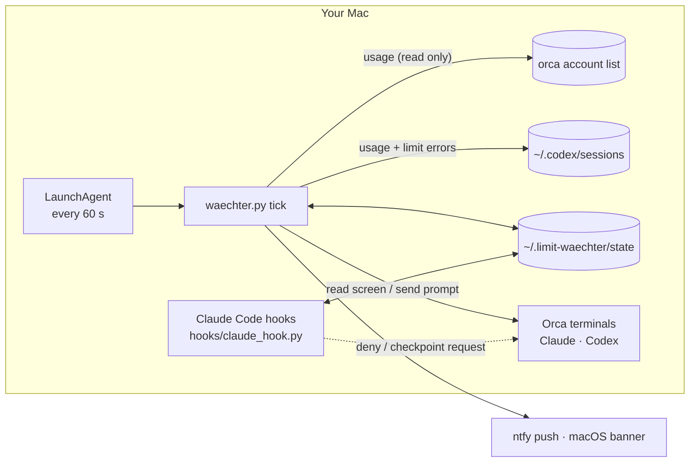

# Agent Limit Watchdog

[](https://github.com/gabba6/agent-limit-watchdog/actions/workflows/tests.yml)


[](LICENSE)

**Stop hitting usage limits blindly.** Agent Limit Watchdog (originally *Limit-Wächter*) watches the usage
limits of **Claude Code** and **Codex** running in [Orca](https://github.com/stablyai/orca) terminals on your Mac.
It warns you before the limit, lets running agents **save their work and pause in an orderly way**, and
**continues them after the reset** – for sessions you put in *night mode*, also while you sleep. It never buys credits.

🇩🇪 Deutsche Bedienungsanleitung: [docs/ANLEITUNG.de.md](docs/ANLEITUNG.de.md)

```
Limit Watchdog 1.2 · 26.09. 16:22
Watchdog: active · last tick 14 s ago · LaunchAgent loaded
Claude  5h 94% (resets 16:30)     week 57% (resets Sun 03:00) phase STOP     data 12 s old (orca)
Codex   5h 44% (resets 22:51)     week 38% (resets Fri 12:04) phase OK       data 2 min old (orca)
Thresholds: warn 80%, stop 92% (5h) · week 80/92% · reserve 20% (no auto-continue above 80% weekly use)
Night mode: on for all sessions until 08:00
Sessions (last 2 days, Orca): 4 Claude, 0 Codex
  claude 7c1e2a9b my-app                       stopped                    · continues from 16:32 · night until 08:00
Mac: on power yes · sleep disabled: yes · awake with lid closed: yes · Amphetamine: yes
```

## Why

Long agent runs die at the worst moment: in the middle of a refactor, halfway through a multi-agent workflow,
at 2 a.m. Claude Code already has a built-in *auto-continue at usage limit* (since 2.1.234), but it has gaps:

- it only reacts **at** the limit – nothing stops the agent *before* it runs out mid-step,
- it does not wait for **weekly** limits (reset more than 24 h away), Remote Control or background sessions,
- after the Mac slept for more than ~30 minutes it waits for someone to press Enter,
- the limit menu contains **paid options** (“Switch to usage credits”, “Upgrade your plan”) – blind automation can cost money.

Codex CLI has no automatic continuation at all.

Agent Limit Watchdog fills these gaps as a thin layer **on top of** Claude Code's official features: it prefers
the built-in auto-continue and only steps in where it does not help.

## What it does

| Phase | When (default) | What happens |
|---|---|---|
| **OK** | below 80 % | nothing |
| **Warning** | 80 % of the 5-hour or weekly window | push notification + macOS banner |
| **Stop** | 92 % | Claude: new subagents/workflows are denied; at the end of the turn the agent gets **one** checkpoint request (update status/handoff file, WIP commit without push, note workflow run IDs) and pauses. Codex: a short message asks the agent to do the same. |
| **Limit** | 100 % or a limit error | sessions are remembered with their reset time; the Mac is kept awake (`caffeinate`) |
| **Reset** | reset time + 2 min | sessions in **night mode** are continued – but only after reading the terminal screen first. All others wait for you to type “continue” (one push per provider); Claude's built-in auto-continue is blocked for them |
| **Weekly reserve** | above 80 % weekly use | no automatic continuation at all (neither by the watchdog nor by Claude's built-in one) |

### Night mode (since 1.1)

The stop always runs for every session, but **continuing after the reset is opt-in**: only sessions in night mode
are continued automatically. Night mode lasts until the next report time (default 08:00) and then switches itself off.

| How | |
|---|---|
| `./waechter.py night on` | all sessions (also ones started later) until 08:00 |
| `./waechter.py night on <id-start or project folder>` | one session (`night off …` to switch off, `night` shows the state) |
| type `#night` in a Claude session | this session (`#night all`, `#night off`); the hook catches it, nothing goes to the model – works via Remote Control too |

Switched on after the reset? Sessions that have been waiting for “continue” for less than 12 hours are picked up within a minute (with the usual screen check). Codex sessions can only be switched via the command. Want the 1.0 behaviour (continue everything)? Set
`[fortsetzen] nur_mit_nachtmodus = false`.

Continuing a session in night mode, in this order:

1. The terminal is already working (e.g. Claude's built-in auto-continue fired) → do nothing.
2. The screen shows a **menu, a purchase option or anything unclear** → **send nothing**, notify you.
3. Claude waits for Enter after sleep → send only Enter.
4. The input line is empty → send a short continuation prompt (“read your last checkpoint, continue only what is open”).
5. The terminal is gone (e.g. after a reboot) → open a new Orca terminal with `claude --resume <id>` / `codex resume <id>`.

At most two automatic continuations per session and limit window; continuations are staggered. At 08:00 you get
a short morning report if something happened overnight.

## How it works



- **Tick** (`waechter.py tick`, run by a LaunchAgent every minute, ~0.4 s): reads usage from Orca and Codex's
  session files, computes the phase, sends notifications, stops Codex in an orderly way and continues sessions
  after the reset. Details: [docs/ARCHITECTURE.md](docs/ARCHITECTURE.md).
- **Claude Code hooks** (`hooks/claude_hook.py`, added to `~/.claude/settings.json` next to your other hooks):
  map sessions to Orca terminals, deny new subagents in the stop phase, give the checkpoint request, record limit
  errors and Claude's `quota_auto_resume_*` notifications. The hooks only act in Orca terminals and go completely
  passive when the watchdog is paused or not running.
- **Notifications** via [ntfy](https://ntfy.sh) (random topic stored only in the macOS keychain) and macOS banners.
  They contain short status texts only – no project names or content.

## Which apps are covered?

| Where the agent runs | Covered? |
|---|---|
| **Claude Code CLI** in an **Orca** terminal | ✅ warn, orderly stop via hooks, limit detection, continue after reset |
| **Codex CLI** in an **Orca** terminal | ✅ warn, orderly stop via a short message, limit detection, continue after reset |
| Claude Code in Terminal.app, iTerm, VS Code/JetBrains terminals | ❌ the hooks deliberately do nothing outside Orca |
| Claude Desktop (incl. its Code tab), claude.ai in the browser | ❌ not controlled |
| ChatGPT / Codex desktop app, Codex IDE extension, chatgpt.com | ❌ not controlled |

Usage in the apps marked ❌ still counts toward the same account limits, so it shows up in the percentages and
can trigger warnings – but only sessions in Orca terminals are stopped and continued.

## Menu bar app (since 1.2)

A small SwiftUI menu bar app shows the same data as `status` at a glance. It is optional; the watchdog runs
without it. The app only calls `waechter.py` (argument list, no shell, 20 s timeout) – it never types into
terminals and never operates limit or purchase menus.

- **Requirements:** macOS 14 or newer and the Xcode Command Line Tools (`swift`, `xcrun`; `xcode-select --install`).
- **Install:** `./install.sh app` – runs the tests, builds the app with `swift build`, signs it ad hoc (no paid
  developer account), copies it to `~/Applications/Limit-Waechter.app` (an existing copy is moved to the backups
  first) and loads a LaunchAgent `<label>.app` so it starts at login (restarted if it crashes).
- **What it shows:** a ring icon in the menu bar (coloured from the warning phase on, moon in night mode, pause
  bars when paused, dashed ring if the watchdog is not running); in the popover a card per provider with 5-hour
  and weekly usage, phase, reset time and countdown, reserve / stale-data hints; the current sessions with their
  state and project folder; whether the watchdog is active and when it last ran.
- **What it can do:** pause for 30 min / 2 h / until further notice and resume; night mode on/off for all
  sessions or per session; change the five thresholds (written to `config.local.toml`); show the report; open the log.
- **Uninstall:** `./uninstall.sh` also unloads the app's LaunchAgent and moves the app and its plist to
  `~/.limit-waechter/backups/` (nothing is deleted).
- Build by hand: `app/build.sh [--ausgabe <dir>] [--projekt <path>]`; self-test without GUI:
  `LimitWaechter --selbsttest tests/fixtures/app/status.json`. Details: [app/README.md](app/README.md).

## Requirements

- macOS (uses launchd, `pmset`, `caffeinate`, the keychain) and `/usr/bin/python3` (3.9+, standard library only –
  nothing to `pip install`; comes with the Xcode Command Line Tools)
- [Orca](https://github.com/stablyai/orca): your agents run in Orca terminals; usage data comes from Orca
- Claude Code **2.1.234 or newer** (hooks, built-in auto-continue); Codex CLI optional
- optional: macOS 14+ and the Xcode Command Line Tools for the menu bar app
- optional: the free [ntfy](https://ntfy.sh) app on your phone

## Install

### Option A – let your coding agent do it

Clone the repository, start Claude Code or Codex inside the folder and paste the prompt from
**[docs/SETUP_PROMPT.md](docs/SETUP_PROMPT.md)**. The agent checks the prerequisites, runs the tests and dry runs,
asks you about language and thresholds, shows you what will change, installs with backups and verifies the result.
It is told never to spend money, not to test with model calls and not to touch other tools' hooks.

### Option B – by hand (about 5 minutes)

1. **Get the code**
   ```sh
   git clone https://github.com/gabba6/agent-limit-watchdog.git
   cd agent-limit-watchdog
   ```
2. **Try it without changing anything**
   ```sh
   ./waechter.py simulate cycle      # full cycle with sample data and a fake Orca
   ./waechter.py tick --dry-run      # one run against your real usage, on a copy of the state
   ```
3. **Optional: personal settings** in `config.local.toml` (ignored by git), for example:
   ```toml
   [allgemein]
   sprache = "de"        # German notifications and output
   name = "Alex"         # shown in the texts the hooks give to Claude

   [schwellen]
   stopp = 90            # stop a bit earlier
   ```
4. **Install**
   ```sh
   ./install.sh
   ```
5. **Notifications on your phone:** install the ntfy app, run `./waechter.py ntfy-subscribe` (copies the random
   topic to the clipboard without printing it) → ntfy app → **+** → paste → subscribe → `./waechter.py test-push`.
6. **Check:** `./waechter.py status` should show “LaunchAgent loaded” and a recent tick.
7. **Optional: menu bar app** (macOS 14+, Xcode Command Line Tools): `./install.sh app`.

### What the installer changes

| Where | What | Undo |
|---|---|---|
| `~/.claude/settings.json` | adds 9 hook entries (backup first; other tools' hooks are compared before writing) | `./uninstall.sh` removes only these |
| `~/.codex/hooks.json` | nothing (backup only) | – |
| `~/Library/LaunchAgents/<label>.plist` | runs `waechter.py tick` every 60 s, starts at login | `./uninstall.sh` unloads it and moves the plist to the backups |
| `~/Applications/Limit-Waechter.app` + `~/Library/LaunchAgents/<label>.app.plist` | only with `./install.sh app`: the menu bar app and its login item | `./uninstall.sh` unloads it and moves app and plist to the backups |
| macOS keychain | one item `limit-waechter-ntfy` with a random ntfy topic | `security delete-generic-password -s limit-waechter-ntfy` |
| `~/.limit-waechter/` | state, logs, morning reports, backups | kept on uninstall; delete it yourself if you want |

`install.sh` runs the whole test suite first and stops if a test fails. Running it again (e.g. after `git pull`)
is safe.

## Usage

| Command | |
|---|---|
| `./waechter.py status` | usage, phase, waiting or blocked sessions (`--all` for all sessions) |
| `./waechter.py night on [session\|all]` / `night off` / `night` | night mode: continue these sessions automatically after the reset (until 08:00) |
| `./waechter.py pause` / `pause 2h` / `pause off` | pause all interventions (Claude's built-in auto-continue keeps working) |
| `./waechter.py thresholds` / `thresholds set warn=80 stop=92 …` | show or change the thresholds (`warn`, `stop`, `weekly_warn`, `weekly_stop`, `weekly_reserve`; written to `config.local.toml`; `--json`; German: `schwellen setzen warnung=…`) |
| `./waechter.py report` | what happened in the last 24 h |
| `./waechter.py simulate cycle` | full dry run with sample data: warning → stop → limit → continue → morning report |
| `./waechter.py simulate stop` | what would happen *now* at 93 % (real terminals are only read) |
| `./waechter.py simulate stop --session <id> --minutes 5` | live stop phase for **one** session only, to try the hooks |
| `./waechter.py tick --dry-run` | one tick on a copy of the state, nothing is sent |
| `./uninstall.sh` | unload the LaunchAgent and remove only our hooks (with backup; nothing is deleted) |

Logs: `~/.limit-waechter/log/waechter.log` (every screen the watchdog looked at before sending is logged there).

## Configuration

All options are in [`config.toml`](config.toml) with comments. The most important ones:

| Option | Default | |
|---|---|---|
| `schwellen.warnung` / `stopp` | 80 / 92 | thresholds for the 5-hour window (`woche_*` for the weekly window) |
| `schwellen.wochen_reserve` | 20 | no automatic continuation above 100 − 20 = 80 % weekly use |
| `fortsetzen.nur_mit_nachtmodus` | `true` | only sessions in night mode are continued (and may use Claude's built-in auto-continue); `false` = 1.0 behaviour |
| `fortsetzen.max_pro_fenster` | 2 | automatic continuations per session and window |
| `fortsetzen.claude_limit_resume` | `"waechter"` | set to `"orca"` if Orca's own rate-limit watcher continues Claude at the limit |
| `fortsetzen.claude_modus` | `"auto"` | permission mode for sessions restarted with `--resume` |
| `allgemein.sprache` | `"en"` | `"de"` for German notifications and output |

## Safety

- **Never spends money.** No extra usage, no credits, no rate-limit reset credits; limit or purchase menus are
  never operated by keystroke. If Codex credits or reset credits go down, you get a notification.
- **Reads before it types.** Every send is preceded by a screen check (menus, countdowns, purchase hints,
  text already in the input line, workflow views where letters act as shortcuts → nothing is sent).
- **Built-in first.** Claude's own auto-continue gets a head start; the watchdog never sends a second
  “continue” into a session that is already working.
- **Only agent terminals.** Only Orca terminals whose agent identity is `claude` or `codex` are addressed.
- **Fails passive.** If the watchdog is not running for 10 minutes, the hooks stop intervening; a crashing
  hook never blocks Claude.
- **Local only.** State, logs and reports stay in `~/.limit-waechter/`; the ntfy topic only lives in the keychain.

> **Terms of service.** Anthropic's consumer terms restrict access “through automated or non-human means”
> unless explicitly permitted. Claude Code's built-in auto-continue is an official feature, and this tool
> prefers it. Typing a continuation prompt into your own interactive session is a grey area. Use this tool at
> your own risk and check the terms of your plan (the same applies to OpenAI / Codex).

## Limitations

- macOS only; agents must run in Orca terminals (see [Which apps are covered?](#which-apps-are-covered)).
- Without a running Orca app there is no Claude usage data (limit errors are still detected).
- Screen texts of Claude Code and Codex change with updates. Unknown screens mean “send nothing and notify”,
  so an update can make the watchdog more cautious, not more dangerous – but it may need new patterns in
  [`lw/bildschirm.py`](lw/bildschirm.py).
- How Codex treats a message sent in the middle of a turn (steer vs. queue) has not been verified yet.

## Roadmap

- ~~v1.1 – night mode~~ – done, see [Night mode](#night-mode-since-11) and the [changelog](CHANGELOG.md).
- ~~v1.2 – menu bar app~~ – done, see [Menu bar app](#menu-bar-app-since-12).

## Development

```sh
cd tests && /usr/bin/python3 -m unittest        # 140+ tests, no network, no model calls
./waechter.py simulate cycle                     # end-to-end dry run with a fake Orca
```

The code uses only the Python standard library (including a tiny TOML parser, because `/usr/bin/python3` is 3.9).
Identifiers and comments are German – the project started as *Limit-Wächter*; all user-facing texts are
available in English and German ([`lw/sprache.py`](lw/sprache.py)). Coding agents: see [AGENTS.md](AGENTS.md).

```
waechter.py            CLI entry point
hooks/claude_hook.py   Claude Code hook
lw/tick.py             one run: data → phases → notifications → actions
lw/quellen.py          data sources (Orca, Codex rollouts, Claude transcripts, pmset)
lw/bildschirm.py       screen check before every send
lw/fortsetzen.py       continuing after the reset
lw/nacht.py            night mode (per session / all, until the report time)
lw/codex.py            Codex terminals: thread mapping, limit detection, orderly stop
lw/sprache.py          all user-facing texts (en/de)
app/                   menu bar app (SwiftUI, swift build, ad-hoc signed)
install.sh             install / update      uninstall.sh   undo
```

## License

[MIT](LICENSE) © 2026 Gabriel Petrovic ([@gabba6](https://github.com/gabba6)). Built as a personal tool with the
help of Claude Code. Not affiliated with Anthropic, OpenAI or Orca.
