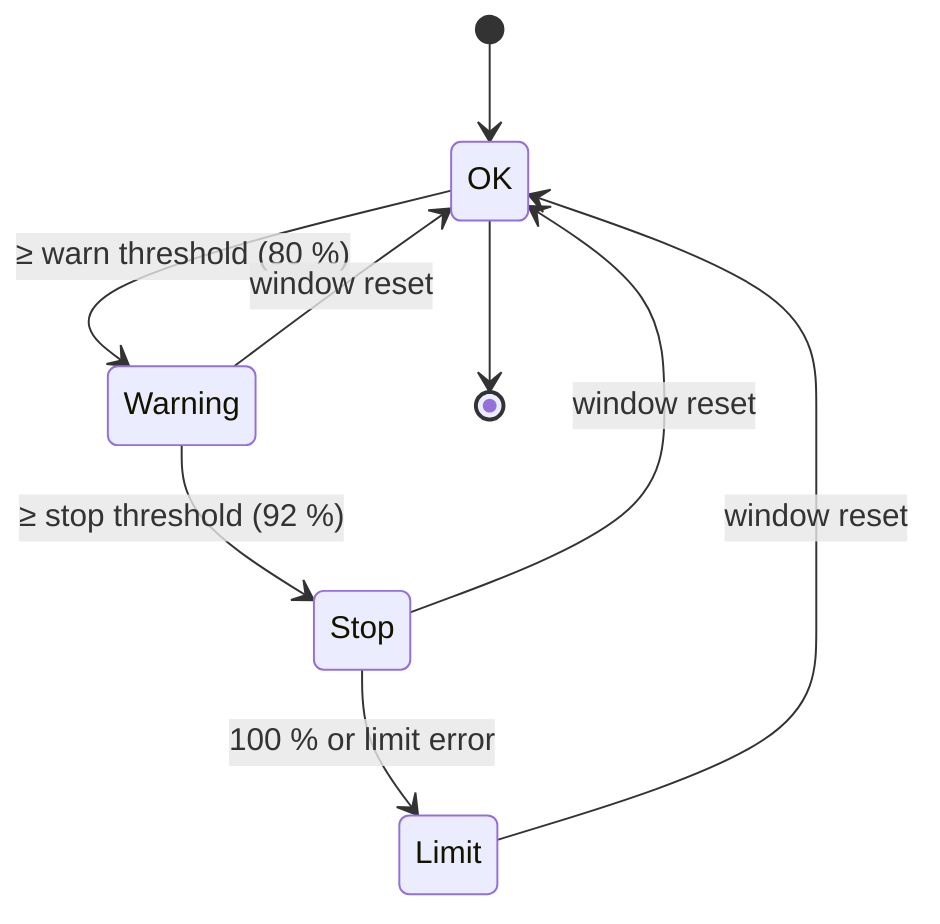

# Architecture

Agent Limit Watchdog has three parts: a **tick** that runs every minute, **Claude Code hooks** that run inside
your Claude sessions, and a small **state folder** both of them share. Since 1.2 an optional fourth part, a
**menu bar app**, shows the state and controls the watchdog through the CLI. Everything is plain Python 3.9 standard
library; the package is called `lw` (from the original German name *Limit-Wächter*).

## Components

| Part | File | Runs | Job |
|---|---|---|---|
| Tick | `waechter.py tick` → `lw/tick.py` | LaunchAgent, every 60 s (~0.4 s) | collect usage, compute phases, notify, stop Codex, continue sessions, keep the Mac awake, morning report |
| Claude hook | `hooks/claude_hook.py` | Claude Code, on hook events | register session with its location (and Orca terminal, if any), deny new subagents, soft-stop note or checkpoint request, optional context note, record limit errors |
| Status line chain | `hooks/statusline.py` | Claude Code, as `statusLine` command | store Claude's `rate_limits` in `state/statusline.json` and the session's context use in `state/kontext/` (throttled, atomic), run the original status line unchanged, then print one own line (1.4) |
| Context window (1.4) | `lw/kontextfenster.py` | status line, tick, hook, CLI | context use per session from the status line input, the Claude transcript or the Codex rollout; levels and pushes |
| Locations | `lw/orte.py` | tick, hook, CLI | location of a session (`orca` / `terminal` / `desktop`) and what the watchdog can do there (`faehigkeiten`, computed, never stored) |
| Night mode | `lw/nacht.py` | tick, hook, CLI | who is continued after the reset: `nacht_bis` per session, `state/nacht.json` for all; ends at the report time |
| Official usage (1.4) | `lw/nutzung.py` | tick (throttled) | read-only request to the providers' usage display, cached without token in `state/offiziell.json` |
| Activity evidence (1.4) | `lw/aktivitaet.py` | tick | did a session really work since a given time? (Claude transcript / Codex rollout, never Orca's state) |
| Awake mode (1.4) | `lw/wach.py` | tick, CLI, `uninstall.sh` | automatic keep-awake (Amphetamine session or `caffeinate`), manual `wach an\|aus` with screen lock |
| State | `~/.limit-waechter/` | – | `state/current.json` (phases for the hooks, plus `nur_nacht` / `nacht_ende`), `state/sitzungen/<provider>-<id>.json` (one file per session, so parallel hooks never overwrite each other), `state/offiziell.json` (official usage cache, no token), `state/kontext/<provider>-<id>.json` (context numbers per session, short history, no content), `state/wach.json` (own `caffeinate` / Amphetamine session), `state/wach-modus.json` (manual awake mode and the previous lock delay, never a password), `log/`, `berichte/` (reports), `backups/` |
| CLI | `lw/cli.py` | you, the app | `status`, `night`, `awake`, `pause`, `thresholds`, `report`, `simulate`, `ntfy-setup`, … |
| Menu bar app | `app/` (SwiftUI) | own LaunchAgent, at login | shows usage, phases, sessions; pause, night mode, awake mode, thresholds, report – only via `waechter.py` |

## Data sources (all read-only)

| Source | Gives | Notes |
|---|---|---|
| `GET https://api.anthropic.com/api/oauth/usage` (1.4) | Claude `five_hour` / `seven_day` `utilization`, `resets_at`, per-model weekly limits | undocumented endpoint behind Claude's usage display; `Authorization: Bearer <token>`, `anthropic-beta: oauth-2025-04-20`; token from the keychain item `Claude Code-credentials` (`claudeAiOauth.accessToken`, `expiresAt` checked first) |
| `GET https://chatgpt.com/backend-api/wham/usage` (1.4) | Codex `rate_limit.primary_window` / `secondary_window` (`used_percent`, `reset_at`) | undocumented endpoint behind ChatGPT's usage display; `Authorization: Bearer` + `ChatGPT-Account-Id` from `~/.codex/auth.json` |
| `orca account list --json` → `result.rateLimits.claude/codex` | 5-hour and weekly `usedPercent`, `resetsAt` | optional (only if Orca is installed); undocumented Orca field, read tolerantly |
| `state/statusline.json` (written by `hooks/statusline.py`) | Claude 5-hour and weekly `used_percentage`, `resets_at` | from Claude's own status line input; for Claude the **fresher** of Orca and status line wins (tie: Orca); `phasen.claude.quelle` says which |
| `~/.codex/sessions/YYYY/MM/DD/rollout-*.jsonl` | Codex `rate_limits` snapshots, `task_complete` with `usage_limit_exceeded`, `session_meta.originator` | fresher than Orca for Codex; the reset time is matched against the “try again at …” message; outside Orca also the source of Codex sessions |
| `claude agents --json` | running Claude sessions (pid, cwd, session id, idle/busy) | before a resume, to avoid starting a session that already runs elsewhere |
| Claude transcript (`quotaLimits`) | exact `resetsAt` and window type after a limit error | read by the `StopFailure` hook |
| Status line input `context_window` (1.4) | `current_usage` {`input_tokens`, `cache_creation_input_tokens`, `cache_read_input_tokens`}, `used_percentage`, `context_window_size`, `model` | read tolerantly; both null (new session, right after `/compact`) → the stored value is kept unless the transcript shows a `compact_boundary` (= 0) |
| Claude transcript `message.usage` (1.4) | context tokens of the last main-thread `assistant` entry (sidechains and API error entries skipped) | fallback when the status line value is missing or more than 5 min older than the transcript; window from the stored value, `[1m]` in the model id or `[kontext] standard_fenster` (more than 200k tokens → 1M) |
| Codex rollout `event_msg`/`token_count` (1.4) | `info.last_token_usage.total_tokens`, `info.model_context_window`; model from `turn_context` | the last entry with `info` counts (same formula as Codex itself, without its 12k baseline) |
| `orca terminal list` / `worktree ps` / `terminal read --screen` | terminals, agent state, the rendered screen | handles are never cached; looked up every tick |
| Orca's `agent-hooks/last-status.json` | pane → provider session id | maps Codex terminals to their thread |
| `pmset`, `ioreg` | power source, sleep settings, lid behaviour | for the night warning |

### Official usage (1.4)

`lw/nutzung.py` reads the two usage endpoints above. Rules:

- **Token handling:** read fresh for every request (keychain via `security find-generic-password -w`, or
  `auth.json`), kept only in a local variable, sent only via https to exactly `api.anthropic.com` /
  `chatgpt.com` (other hosts in the config are refused), never logged, cached, stored or renewed. An expired
  Claude token (`expiresAt`) is not even sent (`abgelaufen`).
- **Throttling:** every `offiziell_intervall_minuten` (3); every `offiziell_intervall_eng_minuten` (1) while a
  provider is in warning/stop/limit or a continuation is due within 15 minutes. HTTP 429 → backoff 5 → 60 min
  (`Retry-After` respected); 401/403 → 15 min pause; network or format errors → next interval.
- **Cache:** `state/offiziell.json` per provider: last success (`stand`), next attempt, error code
  (`auth`, `rate`, `netz`, `format`, `kein_token`, `abgelaufen`, `url`), parsed windows. No token, no headers.
- **Selection:** official data younger than `offiziell_max_alter_minuten` (10) wins; otherwise the freshest of
  official, Orca, status line (Claude) and rollout (Codex). An older value never overwrites a fresher one.
  `phasen.<provider>.quelle` is `offiziell` | `orca` | `statusline` | `rollout`.
- **Early reset:** if the 5-hour or weekly value of a trusted source (official, or status line/rollout at most
  5 minutes old – never Orca alone) drops by at least `frueh_reset_abfall` points (20) before the known reset, or
  `resets_at` moves forward, waiting sessions of that provider get `fortsetzen_ab` pulled forward (due now, or at
  the new reset time), and one push says so.
- **Fallback:** with `[daten] offiziell = false`, in tests/CI (`LIMIT_WAECHTER_OFFLINE=1`) or on any error the
  1.3 sources are used unchanged. If the login has expired while a session waits for a reset, one push per outage
  says so (“open Claude Code once”); other errors only show up in `status` and the app.

Apart from these two read-only requests the watchdog never calls provider APIs and never writes credentials.

## Phases



Phases are computed per provider (Claude, Codex) from the 5-hour and the weekly window; the stricter one wins.
A window whose `resetsAt` has passed counts as 0 %. A recorded limit error keeps the phase at *Limit* until its
reset even if the percentages lag behind. The weekly reserve (default: above 80 % weekly use) blocks automatic
continuation.

## Claude hook events

| Event | Matcher | Behaviour |
|---|---|---|
| `SessionStart`, `UserPromptSubmit` | – | register session ↔ `ORCA_TERMINAL_HANDLE` / pane / worktree; recognise the watchdog's own continuation prompt and Claude's built-in one; **only** with the weekly reserve reached (and `reserve_sperrt_eingebaute_fortsetzung`) block the built-in continuation prompt – since 1.4 never because of night mode (“native first”). `UserPromptSubmit` also: `#night`/`#nacht [on\|off\|all]` switches night mode (`decision: block`, never reaches the model, works even while paused); in *Stop*/*Limit* a note (soft stop: shared with `PostToolUse`, once per window) |
| `PreToolUse` | `Agent\|Task\|Workflow` | in *Stop*/*Limit*: `permissionDecision: deny` with a short reason (also inside subagents); soft stop: “limit close – do not start new subagents/workflows, keep working yourself; running ones may finish” |
| `PostToolUse` | `*` | in *Stop*, once per session and window: `additionalContext` (soft: short note; orderly: stop request); optionally the context note |
| `Stop` | – | **orderly stop only** (weekly stop, weekly reserve, or `claude_stopp_art = "geordnet"`): once per session and window `decision: block` with the checkpoint request (`stop_hook_active` respected); the next stop marks the session as stopped. Soft stop: no block, the session stays `aktiv` |
| `StopFailure` | `rate_limit` | plan limit (not a server throttle): remember the session with its reset time from `quotaLimits` |
| `Notification` | `quota_auto_resume_*`, `permission_prompt` | track Claude's built-in auto-continue (fired / stale / disabled) |
| `PermissionDenied`, `SessionEnd` | – | morning report / mark ended sessions (never auto-continued) |

Location: on every event the hook sets `ort` from its environment (`lw/orte.py`): `ORCA_TERMINAL_HANDLE` → `orca`;
`CLAUDE_CODE_ENTRYPOINT` `claude-desktop`/`desktop`/`local-agent` → `desktop` (probably; not confirmed); `remote`
(Claude Code on the web) and headless runs (`sdk-cli` = `claude -p`, `sdk-ts`, `sdk-py`, `mcp`) → ignored outside Orca;
anything else → `terminal`. Outside Orca, stale Orca fields (`terminal`, `pane_key`, `worktree_id`) are
removed so an old handle is never addressed. The checkpoint request says whether the session will be continued
automatically (outside Orca: no).

Soft or orderly (1.4): `phasen.claude_sanft()` – soft unless `[schwellen] claude_stopp_art = "geordnet"`, the phase
comes from the **weekly** window, or the weekly reserve is reached. At the hard limit Claude then handles itself
(grace note, workflows pause, built-in auto-continue).

Context note (1.4, `[kontext] hinweis_an_sitzung`, default off): on `PostToolUse`/`UserPromptSubmit` the hook reads the
stored context value and adds one `additionalContext` per level (“context at 72 % – prepare a handoff/compaction”);
the level is kept in the session file (`kontext_hinweis`) and reset when the value drops below the warning level.

Guards: with `nur_orca = true` (read from `current.json`) the hook acts only when `ORCA_TERMINAL_HANDLE` is set
(1.2 behaviour); never while paused, never if `current.json` is
older than 10 minutes, never after the window's reset time. Any exception makes it print nothing (Claude
continues normally). Subagent calls (`agent_id` present) are ignored except for the subagent/workflow deny.

## Continuing after the reset

Native first (1.4): Claude's built-in auto-continue is never blocked (only the weekly reserve blocks it). Night mode
only governs the watchdog's own interventions. For every waiting session whose `reset + 2 min` has passed: if
`[fortsetzen] nur_mit_nachtmodus` is on (default) and the session is **not in night mode at that moment** (expired =
off), a Claude session at the limit (`limit` / `eingebaut_wartet`) is left alone until `reset + 3 ×
claude_eingebaut_karenz_minuten` (Claude continues by itself; `status`/the app say so); after that, and for all other
sessions (orderly-stopped Claude, Codex), it becomes `wartet_auf_weiter`: nothing is
sent, the screen is not read, and one push per provider collects all such sessions (held back up to 3 minutes so
sessions resetting together land in one message). A Codex thread leaves that status when its rollout shows new
activity; a Claude session on its next normal prompt. If night mode is switched on later, sessions that have
been in `wartet_auf_weiter` for less than 12 hours go back into the queue with `fortsetzen_ab = now`. Sessions in night mode go on (Claude sessions at the limit
get 5 more minutes so Claude's built-in auto-continue can go first):

1. weekly reserve reached at stop time or now → *reserve*, notify, done
2. already two automatic attempts in this window → *gave up*, notify
3. terminal found (by handle, then by pane) and working → nothing to do. **Since 1.4 Orca's `working` alone is not
   believed** (27.09.2026: a session whose turn had long ended kept a background task running, Orca said
   `working`, and the watchdog waited five hours). With `[fortsetzen] belege_pruefen` (default) “working” needs
   evidence: the screen shows real work (spinner, “esc to interrupt”; a Claude input line ready with a
   background-task footer counts as *ready*), or `lw/aktivitaet.py` finds new `assistant`/`user` entries after the
   halt/reset in the transcript (Claude, sidechains ignored) or rollout (Codex) and the last entry is not a
   finished turn (`stop_hook_summary`, `turn_duration`, `task_complete`). Without evidence the screen decides as
   in step 4.
4. read the screen (`lw/bildschirm.py`): menu, countdown, workflow view, purchase hint, text in the input line,
   unknown → **send nothing**, notify; “press enter to continue” → Enter only; empty prompt → continuation prompt
5. terminal gone → only if `claude agents --json` does not show the session running elsewhere: new Orca terminal
   with `claude --resume <id> --permission-mode auto "<prompt>"` / `codex resume <id> --sandbox workspace-write "<prompt>"`
6. a few minutes later (`pruefen_nach_minuten`): check whether the continued session is stuck at a prompt →
   notify. A session marked “running already” / continued is re-checked too: no new activity since the reset →
   back into the queue and try again (still counted against `max_pro_fenster`; after `max_nachpruefungen`
   re-checks → blocked + notification).

**Outside Orca** (location `terminal`/`desktop`) the watchdog never types, never reads a screen, never opens a
terminal or window (no tmux, no AppleScript). Claude: only Claude's built-in auto-continue (always allowed since 1.4,
except with the weekly reserve); a due session that is still waiting after its grace period becomes `wartet_auf_weiter` and
gets a push with a command to copy (`claude --resume <id>`), never a restart. Codex: push with `codex resume <id>`,
unless `codex_queue` is on (below).

At most two continuations per tick (staggered).

## Keeping the Mac awake (1.4)

`lw/wach.py`, all system calls as argument lists with timeouts, never a shell.

- **Automatic (tick, no password):** while a continuation is pending within the next 12 hours (only sessions that
  will actually be continued) or night mode is on (`[wach] bei_nachtmodus`), until reset + 15 minutes / the end
  of night mode: `caffeinate -i -s` as before, plus – if Amphetamine is installed and automation is allowed – an
  **own, time-limited** Amphetamine session (`start new session with options {duration, interval,
  displaySleepAllowed:true}`, then `enable closed display mode` and `prevent screen saver`, which only affect the
  running session). Only sessions the watchdog started itself (recorded in `state/wach.json`) are ever ended. A
  missing automation permission is detected once and pushed; it then degrades to `caffeinate`.
- **Manual (`wach an|aus|status`, en `awake on|off|status`):** password dialog via `osascript` (hidden answer,
  closes itself after 110 s), `sysadminctl -screenLock off` (previous value saved in `state/wach-modus.json`
  first), unlimited Amphetamine session with closed display mode. `aus` ends it, allows the screen saver again and
  restores the saved lock delay (`[wach] sperre_standard` if none). `sysadminctl -password -` only reads from a
  TTY, so the password is passed as an argument (as the replaced script did): briefly visible in the local process
  list, never logged, stored or put into an error message. An older script's state file (`.vorherige-sperre`
  next to the script in `remote_modus_befehl`, or `[wach] remote_alt_zustand`) is read once and never changed.
- At night the tick still warns if the Mac would sleep with the lid closed or runs on battery; the warning now
  suggests `waechter.py awake on` unless `remote_modus_befehl` names an existing script.
- `uninstall.sh` runs `python3 -m lw.wach rueckbau`: ends the own Amphetamine session and warns if manual awake
  mode is still on (the screen lock stays off until `wach aus`).

## Codex

Codex CLI has no hook that knows about usage limits, and new Codex hooks require an interactive `/hooks` review,
which could block a session at night. So Codex is handled entirely from the tick: in the *Stop* phase, working
Codex terminals get one short message (after a screen check); limit errors are read from the rollout files;
continuing works like for Claude. If Orca explicitly rejects a send, `codex queue --thread <id>` is the fallback.

**Outside Orca (1.3):** candidates are rollout files changed in the last 6 hours (at most 20) that were not mapped
to an Orca terminal in this tick; `session_meta.originator` decides: `codex-tui` → `terminal`, `Codex Desktop` →
`desktop`; `codex_exec`, the Chrome extension and subagents are not watched. A registered `orca` session keeps its
location while Orca is installed but unreachable. By default these sessions are only warned about and get a push.
With `[fortsetzen] codex_queue = true` (experimental, not verified live: Codex asks for a permanent folder trust,
so the live test was not possible) a `terminal` session gets the stop message and, with night mode, the
continuation via `codex queue --thread <id> --message <text>` (argument list, no shell, 60 s timeout); progress is
checked in the rollout file. The Codex app has its own app server, so it is display/warning only.

## Menu bar app (1.2, redesigned in 1.4)

```
LimitWaechter.app ──Process(argv)──▶ /usr/bin/python3 <project>/waechter.py … ──▶ lw/cli.py ──▶ state, config.local.toml
        ▲                                                   │
        └──────────── JSON on stdout (status --json, app-texte, thresholds --json) ◀┘
```

- **No own logic:** the app never reads the state folder or writes config itself. Every action is a CLI call
  (`/usr/bin/python3 waechter.py …`, argument list, no shell, in the background, 20 s timeout):
  `status --json`, `pause 30m|2h`, `pause`, `pause aus`, `nacht an|aus [<full id>]`, `wach an|aus --json`
  (180 s timeout, the password dialog belongs to `waechter.py`),
  `schwellen setzen … --json`, `report`, `app-texte`. The German command names also work when the language is
  English and vice versa. Status is reloaded every 30 s, when the popover opens and after every command.
- **Contract `status --json`:** besides the older keys it has `version`, `jetzt`, `sprache`, `pause_bis`,
  `letzter_tick`, `nur_mit_nachtmodus`, `bericht_uhrzeit`, `schwellen` {`warnung`, `stopp`, `woche_warnung`,
  `woche_stopp`, `wochen_reserve`} and per session `projekt` (folder name of cwd/worktree) and `status_text`.
  Since 1.3 also `orca_vorhanden`, `nur_orca`, `statusline` {`zustand`: `aktiv`|`zurueckgeschrieben`|`aus`, `stand`}
  and per session `ort`, `ort_text`, `faehigkeiten` {`warnen`, `stoppen`, `fortsetzen`: `ja`|`nein`|`push`},
  `faehigkeiten_text` and `automatisch` (will the watchdog really continue it by itself?).
  Since 1.4 also `gesamt` {`stufe`: `stoerung`|`pause`|`limit`|`stopp`|`warnung`|`wartet`|`ok`, `text`, `detail`}
  (the one-sentence banner), `offiziell` {per provider `zustand`: `ok`|`aus`|`fehler`, `fehler`, `stand`},
  `wach` {`an`, `art`: `amphetamine`|`caffeinate`|`aus`, `modus`: `manuell`|`automatisch`|`aus`, `bis`,
  `sperre`, `zugeklappt_ok`, `netzteil`, `amphetamine`, `text`}, per provider `quelle_text` and `woche_modell`,
  and per session `lage` / `lage_text` / `lage_farbe` (state chip) and `aktivitaet` {`letzte`, `quelle`}.
  Since 1.4 (27.09.) also per session `kontext` – `{"prozent": 41.2, "tokens": 412000, "fenster": 1000000,
  "modell": "Opus 5.5", "stufe": "ok"|"warnung"|"kritisch", "stand": <epoch>, "quelle":
  "statusline"|"transcript"|"rollout"}` or `null` – and top-level `kontext_schwellen` {`warnung`, `kritisch`}; a Claude
  session at the limit counts as `automatisch` (Claude continues by itself) with `lage_text` “Claude continues at … by
  itself”; idle sessions (`lage` `ruht`) older than `[anzeige] ruht_stunden` (12) are left out.
  Older output without these keys still works (`tests/fixtures/app/status_v13.json`).
  Examples: `tests/fixtures/app/status.json`, English demo data for screenshots `tests/fixtures/app/status_en.json`. The app decodes every field as optional and drops broken entries.
- **Texts:** the hidden command `app-texte` returns `{"sprache", "texte"}` with all keys starting with `app_`,
  `phase_`, `z_` from `lw/sprache.py`, placeholders unreplaced; the app fills `{name}` itself and formats
  times by `sprache`. So all user-facing texts still live in one place.
- **Thresholds:** `schwellen setzen` accepts integers 1..99 (reserve 0..50), checks the merged configuration
  with `konfig.pruefen()` and writes only `config.local.toml` via `konfig.lokal_setzen()` (keeps other lines and
  comments, atomic replace, keeps file mode, new file 0600). `--json` → `{"ok": true, "schwellen": {…}}` / exit 0 or
  `{"ok": false, "fehler": […]}` / exit 2. Since 1.4 also `kontext_warnung` / `kontext_kritisch` (1..99, warning below
  critical), written to `[kontext]`; `schwellen --json` returns them next to the five thresholds.
- **Build:** `app/build.sh` runs `swift build -c release`, writes `Info.plist` (identifier `<label>.app`,
  `LSUIElement`, minimum macOS 14.0, version = `lw.VERSION`, `LWProjekt` = project path; overridable with
  `LIMIT_WAECHTER_PROJEKT`) and signs **ad hoc** (`codesign -s -`, verified with `--strict`) – no paid certificate.
- **LaunchAgent** `<label>.app`: starts `~/Applications/Limit-Waechter.app/Contents/MacOS/LimitWaechter`,
  `RunAtLoad`, `KeepAlive {SuccessfulExit: false}`, `LimitLoadToSessionType Aqua`, `ProcessType Interactive`,
  logs to `log/app.out.log` / `app.err.log`. Installed only by `./install.sh app`, removed by `./uninstall.sh`.
- **Layout (1.4):** status banner (`gesamt`) → usage cards (5 h large, week smaller, threshold marks, reset,
  source and age) → sessions (state chips, sorted by what needs attention, night-mode moon) → quick switches
  (Night, Awake, Pause) → collapsed settings/thresholds/notes. SF Symbols, light/dark.
- **Self-test:** `LimitWaechter --selbsttest <status.json>` decodes a file with the app's models without GUI
  (exit 0/1); `--version` prints the version. CI builds the app and runs the self-test.
  `LimitWaechter --vorschau --demo <status.json> [--hell|--dunkel] --bild shot.png` renders a screenshot from demo data.

## Design decisions

- **Built-in first:** Claude Code's auto-continue is official; the watchdog fills the gaps instead of replacing it.
  Since 1.4 it never blocks it (only the weekly reserve does), and at the 5-hour stop it only slows Claude down
  (no new subagents/workflows) instead of forcing a checkpoint – Claude's own limit handling does the rest. The
  orderly stop stays where nothing native helps: weekly limits, the weekly reserve and Codex.
- **Continuing is opt-in (1.1):** continuing unattended by the watchdog is a decision per night, so it needs night
  mode (since 1.4 this no longer affects Claude's built-in auto-continue). Night mode is only a timestamp compare – no background job has to switch it off.
- **Unclear means stop:** any screen the classifier does not understand leads to “send nothing, notify”.
- **Money is a hard line:** no code path selects menu options; only a continuation prompt or a single Enter is typed.
- **Fail passive:** stale state disables the hooks; the tick catches its own errors and reports them once a day.
- **No macOS privacy prompts at night:** the LaunchAgent does not probe folders protected by TCC
  (Documents, Desktop, iCloud, …); an Orca terminal that already has access handles those.
- **The app is a thin client (1.2):** one source of truth (the CLI), no second implementation of rules or texts.
- **One file per session:** hooks from many sessions write in parallel without locking each other out.
- **Orca optional, never type outside it (1.3):** without Orca there is no reliable way to read a screen, so the
  watchdog only uses official channels there: hooks, Claude's built-in auto-continue, optionally `codex queue`.
  What a session gets is computed in one place (`orte.faehigkeiten`) and the tick only does what it says.
- **Own status line row (1.4):** the original status line always runs first, its output is passed on
  unchanged and flushed at once; our line comes after it, is built from the same input without network or `git`,
  and any error or timeout in our part only drops our line.
- **Status line: only wrap, never replace (1.3):** the user's status line keeps running unchanged; the original is
  saved in `state/statusline-original.json` (0600, plus a copy in `backups/`) and restored by `uninstall.sh`. Our
  command is marked with `# limit-watchdog-statusline` and must **not** contain `agent-hooks/claude-statusline`:
  Orca treats a `statusLine` command containing that string as its own (“managed”) and overwrites it, while it
  leaves other (“user”) commands alone. That is also why the original lives in a file, not in the command. If
  the entry is replaced anyway, `status`/the app show it (`zurueckgeschrieben`) and usage falls back to Orca.
- **Official numbers first, but never required (1.4):** the usage display endpoints are what the user sees in
  Claude Desktop / ChatGPT, so they are the reference. They are undocumented, so every failure falls back
  silently, the feature can be switched off, and the login is only ever read.
- **Evidence over status flags (1.4):** an agent state reported by another tool is a hint, not proof. Continuing
  is skipped only if the screen or the session's own log shows work; a skipped continuation is re-checked.
- **Keep-awake without a password, lock changes only with one (1.4):** the tick may start and end its own
  time-limited Amphetamine/caffeinate sessions; the screen lock is only touched by the user through the dialog.
- **No automatic continuation in the desktop apps:** there is no official way to send a message into Claude
  Desktop or the Codex app; simulated clicks could hit a purchase button. Claude Desktop keeps Claude's built-in
  auto-continue (governed by night mode through the hooks); the Codex app is display/warning only.
