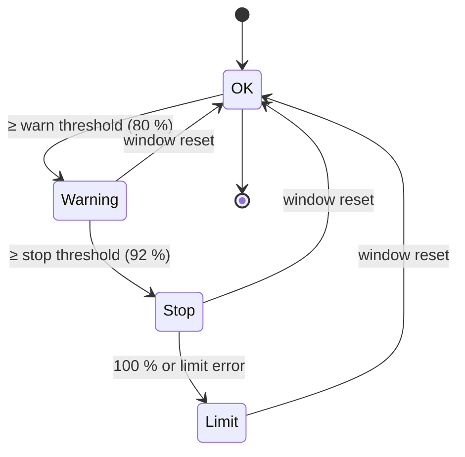

# Architecture

Agent Limit Watchdog has three parts: a **tick** that runs every minute, **Claude Code hooks** that run inside
your Claude sessions, and a small **state folder** both of them share. Everything is plain Python 3.9 standard
library; the package is called `lw` (from the original German name *Limit-Wächter*).

## Components

| Part | File | Runs | Job |
|---|---|---|---|
| Tick | `waechter.py tick` → `lw/tick.py` | LaunchAgent, every 60 s (~0.4 s) | collect usage, compute phases, notify, stop Codex, continue sessions, keep the Mac awake, morning report |
| Claude hook | `hooks/claude_hook.py` | Claude Code, on hook events | map session ↔ Orca terminal, deny new subagents, checkpoint request, record limit errors |
| Night mode | `lw/nacht.py` | tick, hook, CLI | who is continued after the reset: `nacht_bis` per session, `state/nacht.json` for all; ends at the report time |
| State | `~/.limit-waechter/` | – | `state/current.json` (phases for the hooks, plus `nur_nacht` / `nacht_ende`), `state/sitzungen/<provider>-<id>.json` (one file per session, so parallel hooks never overwrite each other), `log/`, `berichte/` (reports), `backups/` |
| CLI | `lw/cli.py` | you | `status`, `night`, `pause`, `report`, `simulate`, `ntfy-setup`, … |

## Data sources (all read-only)

| Source | Gives | Notes |
|---|---|---|
| `orca account list --json` → `result.rateLimits.claude/codex` | 5-hour and weekly `usedPercent`, `resetsAt` | undocumented Orca field, read tolerantly; Claude is updated live through the status line while sessions run |
| `~/.codex/sessions/YYYY/MM/DD/rollout-*.jsonl` | Codex `rate_limits` snapshots, `task_complete` with `usage_limit_exceeded` | fresher than Orca for Codex; the reset time is matched against the “try again at …” message |
| Claude transcript (`quotaLimits`) | exact `resetsAt` and window type after a limit error | read by the `StopFailure` hook |
| `orca terminal list` / `worktree ps` / `terminal read --screen` | terminals, agent state, the rendered screen | handles are never cached; looked up every tick |
| Orca's `agent-hooks/last-status.json` | pane → provider session id | maps Codex terminals to their thread |
| `pmset`, `ioreg` | power source, sleep settings, lid behaviour | for the night warning |

The watchdog never calls usage APIs itself and never reads tokens or credentials.

## Phases

Phases are computed per provider (Claude, Codex) from the 5-hour and the weekly window; the stricter one wins.
A window whose `resetsAt` has passed counts as 0 %. A recorded limit error keeps the phase at *Limit* until its
reset even if the percentages lag behind. The weekly reserve (default: above 80 % weekly use) blocks automatic
continuation.

## Claude hook events

| Event | Matcher | Behaviour |
|---|---|---|
| `SessionStart`, `UserPromptSubmit` | – | register session ↔ `ORCA_TERMINAL_HANDLE` / pane / worktree; recognise the watchdog's own continuation prompt and Claude's built-in one; with the weekly reserve reached, block the built-in continuation prompt. `UserPromptSubmit` also: `#night`/`#nacht [on\|off\|all]` switches night mode (`decision: block`, never reaches the model, works even while paused); without night mode (and `nur_mit_nachtmodus`) the built-in continuation prompt is blocked and the session set to `wartet_auf_weiter` |
| `PreToolUse` | `Agent\|Task\|Workflow` | in *Stop*/*Limit*: `permissionDecision: deny` with a short reason (also inside subagents) |
| `PostToolUse` | `*` | in *Stop*, once per session and window: `additionalContext` with the stop request |
| `Stop` | – | in *Stop*, once per session and window: `decision: block` with the checkpoint request (`stop_hook_active` respected); the next stop marks the session as stopped |
| `StopFailure` | `rate_limit` | plan limit (not a server throttle): remember the session with its reset time from `quotaLimits` |
| `Notification` | `quota_auto_resume_*`, `permission_prompt` | track Claude's built-in auto-continue (fired / stale / disabled) |
| `PermissionDenied`, `SessionEnd` | – | morning report / mark ended sessions (never auto-continued) |

Guards: the hook acts only when `ORCA_TERMINAL_HANDLE` is set, never while paused, never if `current.json` is
older than 10 minutes, never after the window's reset time. Any exception makes it print nothing (Claude
continues normally). Subagent calls (`agent_id` present) are ignored except for the subagent/workflow deny.

## Continuing after the reset

For every waiting session whose `reset + 2 min` has passed: if `[fortsetzen] nur_mit_nachtmodus` is on (default)
and the session is **not in night mode at that moment** (expired = off), it becomes `wartet_auf_weiter`: nothing is
sent, the screen is not read, and one push per provider collects all such sessions (held back up to 3 minutes so
sessions resetting together land in one message). A Codex thread leaves that status when its rollout shows new
activity; a Claude session on its next normal prompt. If night mode is switched on later, sessions that have
been in `wartet_auf_weiter` for less than 12 hours go back into the queue with `fortsetzen_ab = now`. Sessions in night mode go on (Claude sessions at the limit
get 5 more minutes so Claude's built-in auto-continue can go first):

1. weekly reserve reached at stop time or now → *reserve*, notify, done
2. already two automatic attempts in this window → *gave up*, notify
3. terminal found (by handle, then by pane) and working → nothing to do
4. read the screen (`lw/bildschirm.py`): menu, countdown, workflow view, purchase hint, text in the input line,
   unknown → **send nothing**, notify; “press enter to continue” → Enter only; empty prompt → continuation prompt
5. terminal gone → only if `claude agents --json` does not show the session running elsewhere: new Orca terminal
   with `claude --resume <id> --permission-mode auto "<prompt>"` / `codex resume <id> --sandbox workspace-write "<prompt>"`
6. a few minutes later: check whether the continued session is stuck at a prompt → notify

At most two continuations per tick (staggered). While a continuation is pending within the next 12 hours the
tick keeps `caffeinate -i -s` running (only for sessions that will actually be continued) until reset + 15 minutes and, at night, warns if the Mac would sleep with
the lid closed or runs on battery.

## Codex

Codex CLI has no hook that knows about usage limits, and new Codex hooks require an interactive `/hooks` review,
which could block a session at night. So Codex is handled entirely from the tick: in the *Stop* phase, working
Codex terminals get one short message (after a screen check); limit errors are read from the rollout files;
continuing works like for Claude. If Orca explicitly rejects a send, `codex queue --thread <id>` is the fallback.

## Design decisions

- **Built-in first:** Claude Code's auto-continue is official; the watchdog fills the gaps instead of replacing it.
- **Continuing is opt-in (1.1):** stopping protects every session; continuing unattended is a decision per night,
  so it needs night mode. Night mode is only a timestamp compare – no background job has to switch it off.
- **Unclear means stop:** any screen the classifier does not understand leads to “send nothing, notify”.
- **Money is a hard line:** no code path selects menu options; only a continuation prompt or a single Enter is typed.
- **Fail passive:** stale state disables the hooks; the tick catches its own errors and reports them once a day.
- **No macOS privacy prompts at night:** the LaunchAgent does not probe folders protected by TCC
  (Documents, Desktop, iCloud, …); an Orca terminal that already has access handles those.
- **One file per session:** hooks from many sessions write in parallel without locking each other out.
